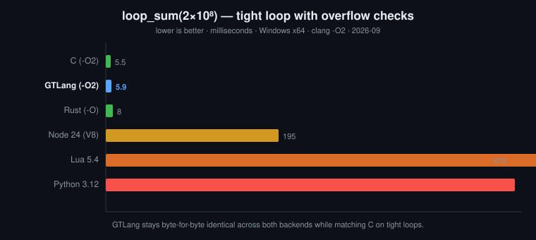

<div align="center">


# GTLang

**GTLang is a statically-typed, compiled, expression-oriented language that runs on a dual backend (LLVM + Cranelift) and speaks Chinese identifiers natively — and its safe defaults match C on tight loops.**

[]()
[]()
[]()
[]()

[中文](README.zh.md) | English



> ⚠️ **Early-stage project.** APIs, syntax, and the standard library may change without notice. Bugs and missing features are expected.
>
> 🪟 **Windows only (for now).** The current build and runtime target Windows x64. Linux/macOS support is not yet available.

</div>

---

## Why GTLang?

- **Fast by default.** Flow-sensitive range analysis elides provably-safe overflow checks, so checked arithmetic still reaches C-level speed (`loop_sum(2×10⁸)`: **5.9 ms**, within 7% of `clang -O2`).
- **One AST, two backends.** The same source compiles to a native executable (LLVM) or runs in memory (Cranelift JIT) with **byte-for-byte identical output**.
- **Safe, not sloppy.** Static types, ownership/borrow checking (flow-sensitive NLL), bounds/overflow/divide-by-zero checks, exhaustive `match`.
- **Bilingual from the ground up.** Chinese identifiers (`计数器`, `累加`, `点`) are first-class, and diagnostics are localized.
- **Genuinely productive.** Generics, traits, `dyn Trait`, enums with payloads, closures, **first-class functions** (pass a `fn` name as a value), macros, `@derive`, real threads, channels, and C interop.

---

## Table of Contents

- [What is GTLang?](#what-is-gtlang)
- [Highlights](#highlights)
- [Quick Start](#quick-start)
- [A Taste of GTLang](#a-taste-of-gtlang)
- [Language Features](#language-features)
- [Dual Backend](#dual-backend)
- [Performance](#performance)
- [CLI Reference](#cli-reference)
- [Project Layout](#project-layout)
- [Architecture](#architecture)
- [Testing](#testing)
- [Documentation](#documentation)
- [FAQ](#faq)

---

## What is GTLang?

GTLang is a **statically-typed**, **compiled**, **expression-oriented** programming language that combines:

- **Rust's memory safety** — ownership, borrowing, flow-sensitive NLL, bounds/overflow/divide-by-zero checks
- **C-level performance** — native machine code via LLVM; tight loops match C
- **Python-like brevity** — expression-oriented, optional type annotations, closures, comprehensions
- **First-class Chinese identifiers** — `计数器`, `累加`, `点` are all valid names
- **Dual backends** — the same AST compiles to a native executable (LLVM) **or** runs in-memory (Cranelift JIT), with **byte-for-byte identical output** enforced by tests

---

## Highlights

| | Feature |
|---|---|
| 🧠 | **Static typing** with bidirectional inference |
| 🛡️ | **Memory safety** — ownership, borrowing, NLL, bounds/overflow checks |
| ⚡ | **Dual backend** — LLVM (release) + Cranelift (JIT), identical semantics |
| 🌏 | **Chinese identifiers** — no transliteration needed |
| 🧬 | **Generics** (monomorphization), traits, **dyn Trait** (vtable dispatch) |
| 🎯 | **Enums with payloads** + exhaustive `match` (ranges, guards, OR-patterns) |
| 🚀 | **Concurrency** — `go` (real threads) + `chan` (unbounded channels) |
| 🔌 | **C interop** — inline C blocks, `extern "C"`, `import c "header.h"` |
| 🧩 | **Macros** — declarative `macro` + `@derive(Eq, Clone, Debug, ...)` |
| 🪄 | **First-class functions** — pass a `fn` name as a value; closures capture containers/params |
| 🔗 | **Ergonomic borrows** — automatic deref for `&T`/`&mut T` fields, methods and params; `dyn Trait` auto-boxing |
| 🧷 | **Rich patterns** — ident bindings, nested destructuring (`Some(Some(v))`), `x or default` |
| 💬 | **Smart diagnostics** — stable codes, bilingual, "did you mean X?" |
| 📦 | **Modules** — `import math` (builtin), `import a.b` (user), `import "x.gt"` |
| 🛠️ | **Toolchain** — `gtc` (compiler / interpreter) |

---

## Quick Start

### Build

> **Prebuilt bundle** (no Rust/LLVM needed): download [`dist/gtlang-res-win-x64.zip`](dist/gtlang-res-win-x64.zip) (10 MB),
extract it anywhere, and run `gtc.exe`. It bundles `gtc`, the standard
library, the runtime, and TCC. It does **not** bundle `clang`/`lld-link`
(≈176 MB) — GTLang locates them on your system `PATH` (or via `GTC_CLANG`).

Or build from source:

```bat
REM Requires Rust (>= 1.75) and LLVM/clang (>= 15) on PATH.
REM Set GTC_CLANG to the full path of clang.exe to override auto-detection.
REM TCC is optional (for inline C blocks); see GTC_TCC below.
build.bat
```

`build.bat` checks the toolchain versions, then builds `gtc`, the
standard library, and assembles a portable `res/` directory.
It takes **no arguments**.

**Optional: TCC for inline C blocks.** GTLang executes inline `C { ... }` blocks
via [TCC](https://bellard.org/tcc/). `build.bat` looks for it in this order:

1. `GTC_TCC` environment variable (a directory containing `libtcc.dll`)
2. `.\tcc` (vendored in this repo)
3. `.\toolchain\tcc`
4. `tcc` on `PATH`

If none is found, the build still succeeds — only inline C becomes unavailable.

This produces:
- `target\release\gtc.exe` — compiler & interpreter
- `target\release\gtc.exe` — compiler / interpreter
- `res\lib\*.dll` — standard library

### Run your first program

Create `hello.gt`:

```gt
fn main() {
    put("你好，世界！")
}
```

Then:

```bat
REM Run directly (Cranelift JIT)
target\release\gtc.exe --run hello.gt

REM Compile to a standalone executable (LLVM + clang)
target\release\gtc.exe hello.gt -o hello.exe -O 2
hello.exe
```

---

## A Taste of GTLang

```gt
// Structs, enums, traits, generics, pattern matching, closures, concurrency
@derive(Debug, Clone, Eq)
struct 点 { x: int, y: int }

enum 形状 {
    Circle(f64)
    Rect(f64, f64)
    Unit
}

trait 面积 {
    fn area(self) -> f64
}

impl 面积 for 形状 {
    fn area(self) -> f64 {
        match self {
            形状::Circle(r) => { return 3.14159 * r * r }
            形状::Rect(w, h) => { return w * h }
            形状::Unit => { return 0.0 }
        }
    }
}

// Generic function (monomorphized)
fn 映射[T](xs: list, f) -> list {
    r := list()
    for x in xs { push(r, f(x)) }
    return r
}

fn main() {
    p := 点 { x: 3, y: 4 }
    put(p.to_str())                    // 点 { x: 3, y: 4 }

    // List comprehension
    平方 := [x * x for x in 0..6]
    put(len(平方))                      // 6

    // Count loop
    loop 3 { put("hi") }

    // Exhaustive match
    s := 形状::Circle(2.0)
    put(s.area())                       // 12.56636

    // Real threads + channels
    ch := chan()
    go 生产者(ch)
    put(chan_recv(ch))                  // 42
}

fn 生产者(ch) {
    chan_send(ch, 42)
}
```

---

## Language Features

### Variables

```gt
a = 1          // bare assignment: auto-declare + infer
x := 2         // inferred declaration (type may change)
let mut y = 3  // inferred, mutable
let n: int = 4 // explicit fixed type
const K = 5    // constant
```

### Control Flow

```gt
if c { ... } elif c2 { ... } else { ... }
loop 3 { ... }              // count loop
while c { ... }
do { ... } while c
for i in 0..n { ... }        // range
for v in container { ... }   // list / [T;N] / str / set / map (iterates keys)
for ... else { ... }        // else runs if no break
outer: for ... { break outer }

match v {
    1 => { ... }
    1..10 => { ... }        // range
    1 | 2 | 3 => { ... }    // OR
    n if n > 0 => { ... }   // guard
    _ => { ... }            // wildcard
}
```

### Functions

```gt
fn add(a: int, b: int) -> int { a + b }   // last expression is returned

fn f(a, b) { ... }                        // types may be inferred
fn g(x: int = 10) { ... }                 // default arguments
g(x: 5)                                   // named arguments

fn id[T](x: T) -> T { x }                // generic
fn max[T](a: T, b: T) -> T where T: Ord { ... }  // where clause

|x| x * 2                                 // closure
|x: int| -> int { x * x }                 // annotated closure

fn inc(x: int) -> int { x + 1 }
g := inc                                  // first-class function (store in a variable)
apply(inc, 5)                             // higher-order (pass as an argument)
fs[0](5)                                  // any expression as callee

o := Some(1)
v := o or 0                              // Option default value

// ergonomic borrows: automatic deref
p := 点 { x: 1, y: 2 }
r := &p
r.x                                     // same as p.x
```

### Structs / Enums / Traits

```gt
struct 点 { x: int, y: int }

enum 形状 { Circle(f64) Rect(f64, f64) Unit }

trait 面积 { fn area(self) -> f64 }
impl 面积 for 圆 { fn area(self) -> f64 { ... } }

fn print_area(s: dyn 面积) { put(s.area()) }  // dynamic dispatch

@derive(Eq, PartialEq, Clone, Debug, Display, Default, Hash, Ord)
struct 点 { x: int }
```

**Available `@derive`s:**

| Derive | Generates |
|---|---|
| `Eq` | `eq`, `ne` |
| `PartialEq` | `eq` |
| `Clone` | `clone` |
| `Debug` | `to_str` → `"Name { f: v }"` |
| `Display` | `to_str` → `"v1, v2"` |
| `Default` | `default` |
| `Hash` | `hash` |
| `Ord` | `cmp`, `lt`, `le`, `gt`, `ge` (+ `<`, `<=`, `>`, `>=`) |

### Operator Overloading

```gt
impl 向量 {
    fn add(self, o: 向量) -> 向量 { ... }
    fn lt(self, o: 向量) -> bool { ... }
}
a + b    // → 向量__add(a, b)
a < b    // → 向量__lt(a, b)
```

### Concurrency

```gt
go 工作者(42)          // spawn real thread
ch := chan()           // unbounded channel
chan_send(ch, v)
v := chan_recv(ch)     // blocking receive
sleep(500)             // milliseconds
```

### C Interop

```gt
C {
    static long long 平方(long long x) { return x * x; }
}
put(平方(5))           // auto-resolves signature

extern "C" { fn puts(s: str) -> int }

import c "native.h" as n            // project-local header only
put(m.sqrt(2.0))
```

### Error Handling

```gt
fn f(n: int) -> Result[int, str] {
    if n < 0 { return Err("negative") }
    return Ok(n * 2)
}

v := f(21)?                                     // ? propagates
match f(-1) { Ok(v) => { ... } Err(e) => { ... } }

o := Some(1)
v := o or 0                                     // default

try { throw "boom" } expt e { put(e) } fily { ... }
```

### Data Extensions

```gt
t := (1, 2)                // tuple
let (a, b) = t             // destructuring
s[0..3]                    // slicing
l[-1]                      // negative index
a, b = b, a                // swap
[x * 2 for x in l if x > 0]  // list comprehension
```

---

## Dual Backend

GTLang ships with **two backends** that consume the same AST:

| | `--c` (LLVM) | `--run` (Cranelift) |
|---|---|---|
| **Output** | Standalone native executable | In-memory |
| **Speed (compile)** | Slower (clang) | Fast (JIT) |
| **Speed (run)** | Faster (optimized) | Baseline |
| **Use case** | Release / distribution | Development / scripting |
| **Consistency** | — | **Byte-for-byte identical output** |

This consistency is enforced by the `tests/consistency.rs` test suite: every test runs the same source through both backends and asserts identical stdout.

---

## Performance

Benchmark: `loop_sum(2e8)` — sum `0..200_000_000` with overflow checks enabled.

| Implementation | fib(35) | loop_sum(2e8) |
|---|---:|---:|
| C (clang -O2) | ~26 ms | ~5.5 ms |
| Rust (rustc -O) | ~28 ms | ~8 ms |
| **GTLang (-O2, checked)** | ~40 ms | **5.9 ms** |
| Node.js 24 (V8 JIT) | ~144 ms | ~195 ms |
| Lua 5.4 | ~445 ms | ~673 ms |
| Python 3.12 | ~1300 ms | ~6788 ms |

**GTLang's default (safe) mode matches C on tight loops** thanks to flow-sensitive range analysis (`src/range.rs`) that elides provably-safe overflow checks — without sacrificing safety.

See [doc/bench.md](doc/bench.md) for methodology.

---

## CLI Reference

```text
gtc --c        <file.gt> [...] [-o out.exe] [-O 0..3]   compile to executable
gtc --run      <file.gt> [...]                          run with Cranelift JIT
gtc --check    <file.gt> [...]                          lex/parse/type-check only
gtc --lint     <file.gt> [...]                          static checks (unused fns/vars, unreachable, ...)
gtc --lint --strict <file.gt>                           warnings are errors
gtc --lint --json   <file.gt>                           JSON output (for CI)
gtc --emit-llvm <file.gt> [...]                         emit LLVM IR
gtc --test     <file.gt>                                run test_ prefixed functions
gtc --watch/-w <file.gt> ...                            watch and rebuild
gtc --version / --verbose                               version / verbose
gtc ... zh                                              Chinese diagnostics

```

---

## Project Layout

```text
src/
lib.rs            module declarations + public API
main.rs           CLI (arg parsing / diagnostic rendering)

lint.rs           static checks (for gtc --lint)
ast.rs            unified AST
lexer.rs          lexer (Chinese identifiers, string interpolation, raw strings)
parser.rs         recursive-descent parser
parser_recover.rs syntax error recovery (panic-mode)
sema.rs           semantic / type checking
type.rs           type system (single source of truth)
codegen/          LLVM backend (mod / expr / call)
jit/              Cranelift backend (mod / stmt / expr / call / rt / symbol)
own.rs            ownership / borrow checking (flow-sensitive NLL)
cblock.rs         inline C extraction + bridging + C header parsing
tcc.rs            libtcc dynamic binding
driver.rs         toolchain location + clang invocation
module.rs         import system + import c
hoist.rs          nested fn / closure lifting + impl/trait flattening
mono.rs           generic monomorphization + method lowering + where checks
opt.rs            optimization passes + macro expansion + list-comp desugaring
range.rs          integer range analysis (elides redundant overflow checks)
unit.rs           frontend output Unit
diag.rs           diagnostic types + source spans
encoding.rs       source decoding
tmp.rs            temp directories
lang.rs           global language switch + bilingual messages
runtime/gt_rt.c   built-in C runtime (concurrency, channels, containers)
stdlib/           standard library source (math.rs / string.rs)
res/lib/            stdlib artifacts (math.dll / string.dll + .lib)
examples/  tests/  bench/
toolchain/          (optional) vendored Rust + LLVM + TCC
```

---

## Architecture

```text
source text
│  cblock::extract  (extract inline C)
▼
lexer → parser → AST
│  module::Linker  (resolve imports, incl. import c)
▼
hoist  (lift nested fns/closures, flatten impl/trait)
│  opt.resolve_named + opt.apply_defaults
│  opt.expand_list_comp + opt.expand_macros
│  expand_derives (@derive)
▼
sema(1)  (fill call-site types)
│  mono  (method lowering + generic monomorphization + operator overloading)
│  opt.inline_and_fold  + sema(2) re-infer
▼
sema(2)  (full type check)
│  own   (ownership / borrow, NLL)
│  opt.dead_code
▼
Unit ──┬── jit::run      (Cranelift)
└── codegen       (LLVM IR → clang)
```

---

## Testing

```bat
cargo test --release
```

**814 tests**:
- **142 unit tests** (`--lib`) — type system, unify, cblock, tmp, AST-traversal completeness
- **149 dual-backend consistency tests** (`tests/consistency.rs`) — same source, both backends, identical stdout (incl. examples/ recursively)
- **522 frontend bulk tests** (`tests/bulk.rs`) — parse + type-check coverage

---

## Documentation

| Doc | Content |
|---|---|
| [doc/LANGUAGE.md](doc/LANGUAGE.md) | Language reference (17 chapters) |
| [doc/PERFORMANCE.md](doc/PERFORMANCE.md) | Performance characteristics |
| [doc/COMPARISON.md](doc/COMPARISON.md) | GTLang vs Python (summary) |
| [doc/GTLang_vs_Python.md](doc/GTLang_vs_Python.md) | GTLang vs Python (detailed) |
| [doc/bench.md](doc/bench.md) | Benchmarks |
| [doc/syntax_status.md](doc/syntax_status.md) | Syntax / feature status |

All docs are available in both **Chinese** (`doc/`) and **English** (`doc/en/`).

---

## FAQ

**Q: Why Chinese identifiers?**
A: GTLang treats Unicode identifiers as first-class. Chinese names like `计数器` or `累加` are as valid as `counter` or `sum`. This makes the language more approachable for Chinese-speaking developers and enables domain-specific naming (e.g. math, geometry) without transliteration.

**Q: Why two backends?**
A: The JIT (Cranelift) gives instant feedback during development; the LLVM backend produces optimized native binaries for release. Both consume the same AST and produce identical output — tests enforce this.

**Q: How is performance so close to C?**
A: Overflow checks are the only cost. Flow-sensitive range analysis elides them when provably safe (e.g. `for i in 0..N { s += i }`), letting LLVM vectorize the loop. See `doc/bench.md`.

**Q: Is there a garbage collector?**
A: Not yet. Containers are reference-semantics and live until process exit. RC primitives (`gt_rc_inc` / `gt_rc_dec`) are in place; instrumentation is pending.

**Q: What's not implemented?**
A: Inline assembly (removed), `async/await` (overlaps with `go`), full GC instrumentation, cross-compilation, procedural macros. See [doc/syntax_status.md](doc/syntax_status.md).

---

## License

MIT (see [LICENSE](LICENSE) if present).


(End of file - total 510 lines)
</content>
